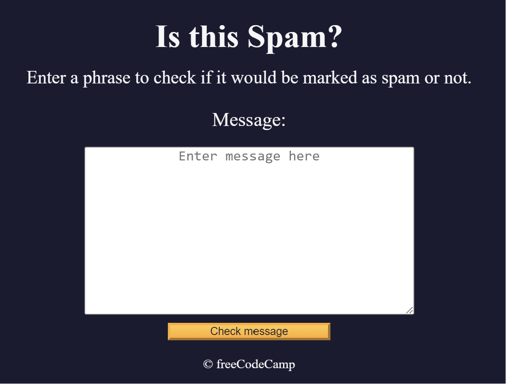

# This repository contains Javascript projects from the freeCodeCamp platform.

## The projects include:

- **_Role Playing Game_**
  
- **_Calorie Counter_**
  
- **_Music Player_**
  
- **_Date Formatter_**
  
- **_Palindrome Checker_**
  
- **_Football Team Cards_**
  
- **_Todo App_**
  
- **_Roman Numeral Converter_**
  
- **_Number Sorter_**
  
  - **_Statistics Calculator_**
    
- **_Spam Filter_**
  

**Projects can be found at:** [freeCodeCamp](https://www.freecodecamp.org/learn/javascript-algorithms-and-data-structures-v8/)
